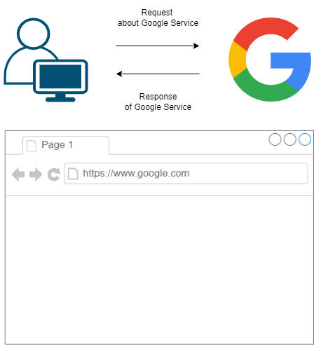

# Overview of WEB-APP
* Intro
* Analysis of Front and Back
* URL and HTTP
* Implementation

# Intro

(TO ME) Web Service is 'Electroic Vending Machine'

I think WEB-APP can be figuratively mapped with 'Electronic Vending machine'.

The Electronic vending machine you encounter has __'Front and Back'__.

It is waiting for calls of client that canbe human's actions, or more specifically calls of web browser like 'chrome'.

Clients call the WEB-APP(Web service Application) by __URL__.

## Analysis of Front and back

WEB-APP = Front + Back (= Front-End + Back-End)

Front = ((html + css) + javascript) ; (index.jsp), (index.mustache), ...

Back = ( (API of WEB-APP + Server) + Database )

; ( (config and controller.java of JAVA-APP + AWS Linux Server) + mybatis-OracleDB ), ...

*Server = ( OS + HW ), and Server has at least 2 kinds and combination of those; Web Server, Web Application Server(WAS), etc.

#### Flow between Front and Back

Let's assume that you input the primary url and WEB-APP returns the index page,

and it can be regarded as "Menu of Web Service".

Generally, Menu of Web Service provides choices of buttens mapped with other urls.

And those urls is mapped with functions of back-end of Electronic Vending Machine

So, You can access the functions that control the resources of Web Service.

###### control? then Controller
this conception of flow canbe described at the perspective of back-oriented as 'Controller of MVC pattern'.

# URL and HTTP

## URL : Uniform Resource Locater
(ex)https://www.google.com

Generally, if human user clicks or inserts the certain URL,

then, URL(or 'internet address') calls the function of WEB-APP.

And function provides html documents which is, in other words, Front-End.

more specifically, "index page"  like index.jsp, index.mustache, ...

#### URI : Uniform Resource Identifier
(To be supplemented later)

## HTTP : Hypertext Transfer Protocol
(TO ME) Data Transfer Protocol of WEB

Hypertext is major one of Data of WEB.

but this H.Y.P.E.R.T.E.X.T makes me think hyper, hyper, hyper , etc

 To begin with, i will regard it Data.

# Implementation of WEB-APP

In my Github, basic framework is 'Spring (boot)'

In this perspective, Spring Framework is a core joint of Front-End tool like jsp, Persitence-Framework like myBatis, Server that has runtime like AWS Linux

(ex)

　　　　　　　　　　　　　　　　　:arrow_upper_right: Front-End like index.jsp

Spring Framework with Build Tool　　:arrow_right: Back-End like HomeController.java

　　　　　　　　　　　　　　　　　:arrow_lower_right: Server

　　　　　　　　　　　　　　　　　:arrow_lower_right:  DBMS - Database

####
Above description maybe suggests blueprint of implementation of web app
but to implement web app, Many Configurations of jsp, Spring with java & mybatis, Server, DBMS.....

## 4 categories of functions of WEB-APP ; CRUD
Categories of functions based on processing resources like data of DB, ...

1. Create
Button send url, generally inserts the new data into the DB of WEB-APP.

2. Read
Button sends url that requires the infomations user want to see.

3. Update
Button sends url that requires change the data of DB, generally based on sub part of url.

4. Delete
Button sends url that requires remove the data of DB, generally based on sub part of url.

#### Story of CRUD
Click the 'sign in' button of site,and do something(Create)

Click the 'see the detail of account' button after log in,and see the infomations of your account,(Read)

Click the 'change the nikckname' button, and do something,(Update)

Click the 'Withdrawal from site' button,(Delete)

## Analysis2 of WEB-APP
(TO ME) WEB-APP = Client + API

#### Client
One of Client is 'Android App without DB' that requests data of server.

Client is Very similar, but different from front of webapp by like jsp.

jsp is server side script. but Android App is an area independent from the server where the web app is originally installed.

In this context, An API can be described as receiving a request from a client and returning a response.

#### API
(TO ME) Restful API

Client-Side Language like react, vue of Javascript has much more Role and Reposibility of Front of Web App.

The front-end has become more independent of the back-end like Android apps.

In this Context, I think,

the existing backend area canbe regared as API which is faithful to the concept of 'receiving and responding to data requests'.

and, A Restful API is an API that effectively responds to a request with appropriate information from resources.

## Implementations of Web Application
(TO ME) WEB APP = Front + Back = Client + API

[JAVA-APP](https://github.com/devsacti/JAVA-APP)

[PYTHON-APP](https://github.com/devsacti/PYTHON-APP)

### The Relates
[Server](https://github.com/devsacti/Server)

[Server ; Cloud-Server](https://github.com/devsacti/Cloud-Server-and-Extensions)

# References
1. Image of Front-End and Back-End - https://blog.dalso.org/language/web/6523